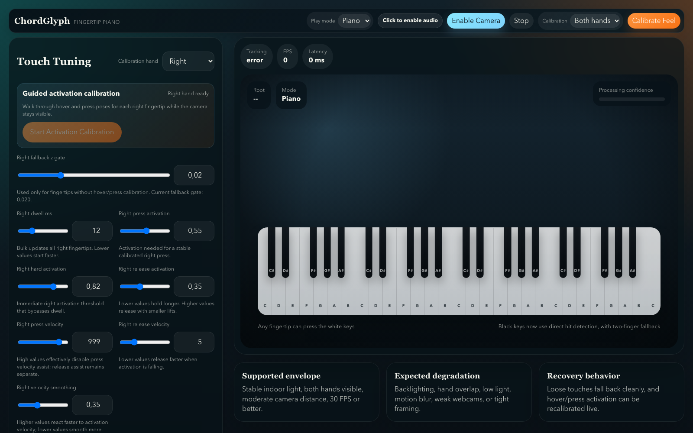
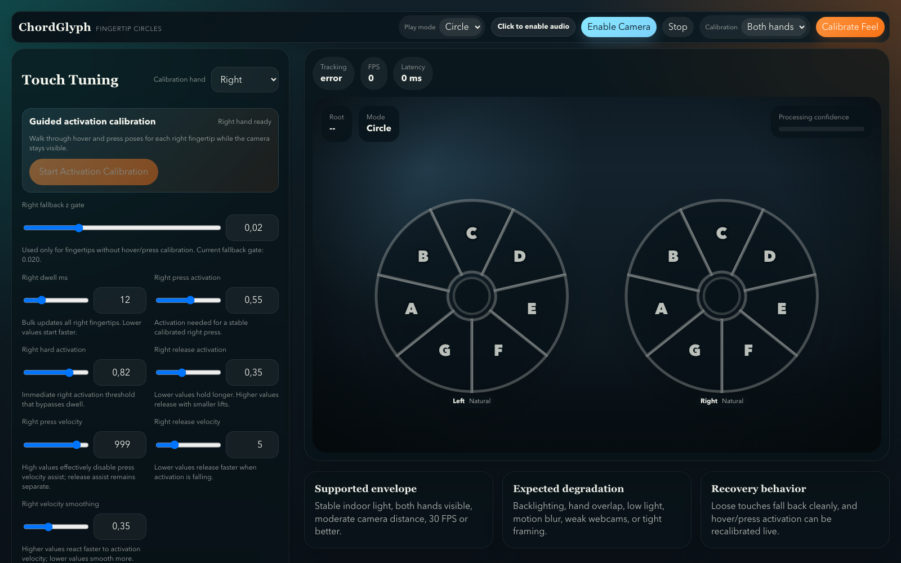

# ChordGlyph

ChordGlyph is a browser-based gesture instrument. It uses a webcam to track hands, renders playable music surfaces over the camera feed, and produces synth audio directly in the browser.

## Features

- **Piano mode**: a configurable on-camera piano keyboard with z-gated fingertip activation.
- **Circle mode**: two z-free note circles, one per hand, for more reliable performance when webcam depth feels noisy.
- **Per-hand controls**: independent left/right depth gates, per-finger sensitivity, hover/press calibration, and activation tuning.
- **Calibration flow**: guided playing-feel calibration with hover capture, tap capture, quality summaries, keyboard fallbacks, and calibration audio cues.
- **Debug overlays**: optional hit boxes, fingertip stats, active key/circle highlighting, and per-finger depth readouts.
- **Audio routing**: Web Audio synthesis with a visible arming status and optional browser-supported output-device selection for wired or Bluetooth devices.
- **Persistent settings**: user tuning is saved locally in IndexedDB and restored on reload.

## Modes

### Piano

Piano mode overlays a keyboard under the hand-tracking layer. Only fingertip landmarks can press keys. Calibrated fingertips map weighted webcam depth into activation, with separate press, hard-press, release, dwell, and velocity-assist settings.



Useful controls:

- **Piano position**, **key height**, **key width**, and **octaves** tune the visual keyboard and hit-test geometry together.
- **Hit boxes** helps debug whether rendered keys and detection bounds align.
- **Fingertip stats** toggles the numeric `model`, `base`, `s`, `wd`, `act`, and `v` labels.
- **Touch tuning** adjusts per-hand and per-finger activation behavior.

### Circle

Circle mode avoids z-depth entirely. Each hand gets a seven-segment note circle. Enabled fingertips trigger notes by 2D position, and the same hand shape selects chord quality.



Useful controls:

- Enable or disable triggering fingertips per hand.
- Switch either hand between natural note order (`C D E F G A B`) and circle-of-fifths order (`C G D A E B F`).
- Use the chord legend for single, major, minor, diminished, major seventh, and minor seventh shapes.

## Calibration

Piano calibration is per hand and per fingertip. The full flow is available from **Calibrate Feel** in the top bar, and quick manual hover/press capture is available in **Touch Tuning**.

Recommended piano setup:

1. Select **Piano** mode.
2. Position and size the keyboard so fingertips clearly land inside the intended keys.
3. Enable **Hit boxes** and **Fingertip stats** while tuning.
4. Use **Calibrate Feel** for a guided pass, or use **Set Hover** / **Set Press** on individual fingers.
5. If releases feel sticky, raise release activation or lower release velocity.
6. If presses need exaggerated movement, lower press activation or hard activation.

The app uses webcam/model-relative z values, not physical centimeters. For standard RGB webcams, z-depth is inherently noisy; Circle mode is intentionally available as a more stable performance option.

## Development

```bash
npm install
npm run dev
```

Validation:

```bash
npm test -- --run
npm run build
```

## Notes

- Camera tracking runs locally in the browser through MediaPipe Hands.
- Audio is generated locally through Tone.js/Web Audio.
- Browser autoplay policies still require a user gesture before sound can start; the audio status pill shows whether audio is ready, arming, blocked, or retryable.
